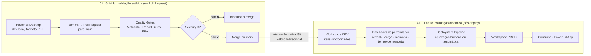

<div align="center">


# Power BI → GitHub → Fabric
### Esteira de CI/CD com Quality Gates

**Versione, padronize e certifique seu Power BI em escala enterprise, com _quality gates_ automáticos antes e depois de cada publicação.**

[](.github/workflows/bpa-quality-gate.yml)
[](pbi-project/)
[](#-roadmap)
[](scripts/bpa/BPA_Rules.json)

📖 **Página explicativa (interativa):** **[white-meadow-0edcbf410.7.azurestaticapps.net](https://white-meadow-0edcbf410.7.azurestaticapps.net/)**
<br />
<sub>💡 Para uma melhor experiência, acesse pelo Google Chrome.</sub>

</div>

---

## 📑 Índice

- [O que é este projeto](#-o-que-é-este-projeto)
- [O problema que resolve](#-o-problema-que-resolve)
- [As duas etapas de validação](#-as-duas-etapas-de-validação)
- [Arquitetura da esteira](#-arquitetura-da-esteira)
- [Severidades: como o gate decide](#-severidades-como-o-gate-decide)
- [Validação incremental](#-validação-incremental-só-o-que-mudou)
- [O que aparece no Pull Request](#-o-que-aparece-no-pull-request)
- [Estrutura do repositório](#-estrutura-do-repositório)
- [Como usar / testar](#-como-usar--testar)
- [Como adaptar à sua realidade](#-como-adaptar-à-sua-realidade)
- [Stack e tecnologias](#-stack-e-tecnologias)
- [Referências e créditos](#-referências-e-créditos)

---

## 🎯 O que é este projeto

Uma **esteira de CI/CD para Power BI**, do **commit** até o **Microsoft Fabric**, que adiciona
**versionamento, padronização e esteira de qualidade** ao processo de criação de relatórios e
modelos, de forma **automática** e **como código** (_pipeline-as-code_).

A ideia central: tratar um projeto de Power BI como qualquer outro software. Ele vive no **Git**
(no formato **PBIP**, versionável em texto), passa por **validações automáticas** a cada Pull Request
e só chega ao ambiente de produção do **Fabric** após ser aprovado.

---

## 🔥 O problema que resolve

Sem uma esteira, cada publicação de Power BI pode se tornar um risco:

| Dor comum | O que a esteira traz |
|---|---|
| 🧩 **Sem padronização**: cada dev modela e formata do seu jeito | Regras de boas práticas aplicadas automaticamente a todos |
| 🚪 **Deploy sem trava**: erro só aparece depois de publicado | _Quality gates_ que barram o problema **antes** do merge |
| 👥 **Sem colaboração & reuso**: arquivos `.pbix` binários, sem histórico | Projetos **PBIP** versionados no Git, com histórico e code review |
| ⏰ **Erro tardio**: quebra descoberta pelo usuário final | Feedback imediato no PR, onde o dev já está |

---

## 🧭 As duas etapas de validação

A validação acontece em **dois momentos** com objetivos diferentes. As validações abaixo são
**exemplos já construídos** e prontos para uso, mas tudo é **customizável**: você pode ajustar,
adicionar ou remover regras, e até **criar novas etapas** conforme a necessidade da sua empresa.

### 1️⃣ Etapa estática, no **GitHub**
Roda no **Pull Request** via **GitHub Actions**, em _runners_ efêmeros, **sem Fabric**. A validação ocorre direto nos arquivos, antes do merge com a branch principal. Exemplos de validações já constrúidas:

- **Metadata**: integridade e estrutura do projeto PBIP (arquivos, pastas e definições no lugar certo).
- **Report Rules**: boas práticas do relatório via **Fab Inspector**, como layout padronizado,
  acessibilidade, interações e campos ocultos.
- **BPA**: boas práticas do modelo via **Tabular Editor 2**, como nomenclatura, formatação de medidas,
  relacionamentos e colunas não usadas.

### 2️⃣ Etapa dinâmica, no **Fabric**
Roda **após o deploy**, com o modelo publicado e atualizado. Valida o que existe em
tempo de execução:

- **Testes de carga**: acessos simultâneos ao dashboard.
- **Uso de memória**: consumo do modelo dentro da _capacity_.
- **Tempo de resposta**: performance de medidas e visuais.

> Tudo é definido em **YAML** (_pipeline-as-code_): regras, gates e severidades são **totalmente
> configuráveis** conforme a necessidade da sua empresa. As regras são um ponto de partida, não uma
> camisa de força.

---

## 🏗️ Arquitetura da esteira

Tudo é **pipeline-as-code**: o `.yml` versionado **é** a infraestrutura. Ao abrir o PR, o GitHub cria
_runners_ efêmeros sob demanda, executa os passos e destrói as máquinas.



**Como as duas lanes se conectam:**

- **CI · GitHub (estático):** ao abrir o PR, o `Discover_Projects` seleciona só os projetos alterados;
  em paralelo rodam **Metadata** e **Report Rules**; se ambos passam, roda o **BPA** (Tabular Editor 2).
  Havendo **Severity 3**, o merge é bloqueado.
- **Ponte Git ↔ Fabric:** com o merge na `main`, a **integração nativa do Fabric com o Git** entrega o
  conteúdo ao workspace, com sincronização **bidirecional** (mudanças no Git refletem no Fabric e
  vice-versa).
- **CD · Fabric (dinâmico):** no workspace **Dev**, notebooks avaliam a performance com dados reais; um
  **Deployment Pipeline** com **aprovação humana** promove o conteúdo de **Dev → Prod**, consumido via
  **Power BI App**.

> ✅ **O que está aqui são exemplos prontos para uso, mas 100% adaptáveis.** Cada empresa pode trocar
> ferramentas, adicionar/remover gates e ajustar o fluxo (inclusive a etapa dinâmica no Fabric) conforme
> a sua realidade.

---

## 🚦 Severidades: como o gate decide

**Tudo isto é totalmente customizável.** Você atribui uma **severidade (nota)** a cada regra (inclusive
às regras que a sua empresa criar) e é **você quem define** o que **apenas avisa** e o que **reprova** a
mudança, obrigando o desenvolvedor a ajustar antes de publicar:

| Severidade | Rótulo | Efeito no gate | Label |
|:--:|---|---|---|
| **3** | 🚨 Corrigir obrigatoriamente (_Must Correct_) | **Reprova** o build e bloqueia o merge | `bpa-failed` |
| **2** | ⚡ Corrigir o quanto antes (_Correct ASAP_) | Passa, mas alerta no comentário | `bpa-warning` |
| **1** | 💡 Bom ter (_Nice to Have_) | Passa (sugestão de boa prática) | `bpa-passed` |

Para mudar o que **bloqueia** ou apenas **alerta**, basta ajustar o campo `CustomSeverity` de cada
regra no [`scripts/bpa/BPA_Rules.json`](scripts/bpa/BPA_Rules.json). O mesmo conceito de severidade
vale para as regras que você criar.

---

## ⚙️ Validação incremental (só o que mudou)

Com reports, modelos e dashboards **versionados no Git**, vários times colaboram no mesmo repositório
em paralelo. Logo no início, um **job de descoberta** faz o `diff` do PR contra a base e seleciona
**apenas os projetos PBIP alterados**: a esteira foca só no que mudou.

| Cenário | O que é validado |
|---|---|
| PR altera um projeto | apenas o projeto alterado |
| PR altera vários projetos | todos os alterados |
| PR não toca nenhum PBIP (só docs/scripts) | nada (_no-op_, passa) |
| Execução manual (`workflow_dispatch`) | **todos** os projetos (fallback seguro) |

✅ **Zero config:** adicionar um novo projeto PBIP **não exige mexer no workflow**: ele é descoberto
automaticamente (qualquer pasta que contenha um `*.pbip`).

---

## 💬 O que aparece no Pull Request

Cada gate posta um comentário automático (em **pt-br**), seguindo o mesmo padrão:

1. **Título com status**: ✅/❌ direto ("pode ou não publicar").
2. **Link do log/artefatos** da execução.
3. **`### 📊 Resumo`**: tabela com a contagem de problemas por severidade/status.
4. **Detalhes**: regras violadas, objetos afetados e **links para a descrição de cada regra**
   (valor educativo: o dev aprende _por quê_, não só corrige para passar).

> Exemplo (BPA): _"❌ O modelo não pode ser publicado enquanto os problemas de Severidade 3 não forem
> corrigidos"_ → seguido do resumo e da lista de ocorrências, com Severity 3 expandido por padrão.

---

## 🗂️ Estrutura do repositório

```
fabric-ci-cd/
├─ .github/workflows/
│  └─ bpa-quality-gate.yml        # A esteira (pipeline-as-code)
├─ pbi-project/                   # Projeto demo: Customer Profitability Sample (PBIP)
├─ scripts/
│  ├─ metadata_validation/        # Gate 1 · integridade dos arquivos PBIP
│  │  ├─ pbip_metadata_validation.py
│  │  └─ pbip_pr_comment.py
│  ├─ fab_validator/              # Gate 2 · boas práticas do relatório
│  │  ├─ fabinspector-report-rules.json
│  │  └─ fabinspector_pr_comment.py
│  ├─ bpa/                        # Gate 3 · boas práticas do modelo
│  │  ├─ Custom_TA_Macro_for_BPA.csx
│  │  ├─ BPA_Rules.json           # As regras built-in + CustomSeverity
│  │  ├─ bpa_rules.md             # Documentação das regras (links do PR)
│  │  ├─ bpa_result_analysis.py
│  │  └─ pr_comment.py
│  └─ notebooks/                  # Validações dinâmicas no Fabric (Etapa 2 · CD)
└─ web/                           # Página explicativa interativa (site público)
```

---

## 🚀 Como usar / testar

### Pré-requisitos
- Uma cópia (fork) deste repositório no GitHub (o workflow usa o `GITHUB_TOKEN` nativo, **sem PAT**).
- **Power BI Desktop** com o formato **PBIP** habilitado (para editar os projetos localmente).
- _(Opcional, para editar/testar regras)_ **Tabular Editor 2** (gratuito).

### Testar a esteira em um PR
1. Crie uma branch a partir de `main` e faça uma alteração em um projeto (`pbi-project/...`).
2. Abra um **Pull Request para `main`**.
3. Acompanhe em **Actions** → workflow _"Power BI BPA Quality Gate"_.
4. Veja os **comentários automáticos** e as **labels** no PR; os CSVs ficam nos _artifacts_ da run.
5. Se houver **Severity 3**, o gate **reprova**: corrija e faça novo push para ficar verde.

> 💡 O modelo demo contém _auto-date tables_, tratadas como Severity 3 pela regra "Remove auto-date
> table". Por isso o gate **reprova de início**: ótimo para ver o bloqueio funcionando.

---

## 🧩 Como adaptar à sua realidade

Este projeto foi feito para ser **ponto de partida**. Formas de adaptar:

<details>
<summary><strong>➕ Adicionar seus próprios projetos Power BI</strong></summary>

Basta salvar o projeto no formato **PBIP** em uma pasta do repositório. O job `Discover_Projects`
detecta automaticamente qualquer pasta com um `*.pbip`: **não é preciso editar o workflow**.
</details>

<details>
<summary><strong>🎚️ Ajustar quais regras bloqueiam (severidade)</strong></summary>

Edite o campo `CustomSeverity` de cada regra em
[`scripts/bpa/BPA_Rules.json`](scripts/bpa/BPA_Rules.json):
`3` bloqueia o merge, `2` só alerta, `1` é sugestão. Alinhe o rigor ao padrão do seu time.
</details>

<details>
<summary><strong>📚 Criar novas regras de BPA (via JSON)</strong></summary>

As regras são **parametrizadas em JSON**, direto no
[`scripts/bpa/BPA_Rules.json`](scripts/bpa/BPA_Rules.json): **não é preciso abrir o Tabular Editor**.
Basta adicionar um objeto com `Name`, `Category`, `Scope`, `Expression` e os campos da esteira
(`CustomSeverity`, `ID`, `Anchor`), e documentar a regra em
[`scripts/bpa/bpa_rules.md`](scripts/bpa/bpa_rules.md).

> 💡 Se quiser, use o **Tabular Editor 2** apenas como apoio para montar/testar a `Expression`
> (ele tem IntelliSense e teste contra o modelo), mas isso é **opcional**.

O ruleset oficial e atualizado da Microsoft fica em
[Analysis-Services / BestPracticeRules](https://github.com/microsoft/Analysis-Services/tree/master/BestPracticeRules).
</details>

<details>
<summary><strong>🎨 Ajustar as regras de relatório (VisOps)</strong></summary>

Edite [`scripts/fab_validator/fabinspector-report-rules.json`](scripts/fab_validator/fabinspector-report-rules.json)
Altere parâmetros (ex.: `paramMaxVisualsPerPage`) ou marque `"disabled": true` numa regra.
</details>

<details>
<summary><strong>🧪 Ajustar a validação de metadados</strong></summary>

As checagens de integridade dos arquivos PBIP ficam em
[`scripts/metadata_validation/pbip_metadata_validation.py`](scripts/metadata_validation/pbip_metadata_validation.py)
(sem dependências além do Python). Adicione ou relaxe verificações conforme a estrutura do seu projeto.
</details>

<details>
<summary><strong>➕ Adicionar novas etapas / gates ao pipeline</strong></summary>

Como tudo é **pipeline-as-code**, novas etapas são apenas novos _jobs/steps_ no
[`.github/workflows/bpa-quality-gate.yml`](.github/workflows/bpa-quality-gate.yml). Você pode encadear
validações extras (ex.: testes de DAX, refresh, performance) reaproveitando o `Discover_Projects` para
rodar só nos projetos alterados.
</details>

<details>
<summary><strong>💬 Personalizar os comentários do PR</strong></summary>

O texto, o formato e as labels de cada gate são gerados pelos scripts `*_pr_comment.py`
(`metadata_validation`, `fab_validator`, `bpa`). Ajuste os títulos, o resumo e os detalhes para o
tom/idioma do seu time mantendo o mesmo padrão visual.
</details>

<details>
<summary><strong>🔒 Tornar o gate realmente bloqueante</strong></summary>

Por padrão, um check que falha **apenas sinaliza** (o ❌), mas não impede o merge. Para bloquear de
fato, ative a _branch protection_ na `main`: `Settings → Branches → Add branch ruleset` →
**Require status checks to pass before merging** → selecione o check **"BPA"**.
</details>

---

## 🧱 Stack e tecnologias

**GitHub Actions** · **Power BI (PBIP)** · **Tabular Editor 2 (BPA)** · **Fab Inspector (PBI Inspector V2)**
· **Python (stdlib + pandas)** · **Microsoft Fabric** · **Mermaid** · Pipeline-as-code em **YAML**.

---

## 📚 Referências e créditos

- 🌐 **Página explicativa interativa (site público):** [white-meadow-0edcbf410.7.azurestaticapps.net](https://white-meadow-0edcbf410.7.azurestaticapps.net/) (código em [`web/`](web/)). 💡 _Para uma melhor experiência, acesse pelo Google Chrome._
- 🧠 **Regras oficiais de BPA (Microsoft / Michael Kovalsky):**
  [Analysis-Services · BestPracticeRules](https://github.com/microsoft/Analysis-Services/tree/master/BestPracticeRules).
- 🛠️ **Tabular Editor · Built-in BPA Rules:**
  [docs.tabulareditor.com](https://docs.tabulareditor.com/en/features/built-in-bpa-rules.html).

---

<div align="center">

**Qualidade automatizada, do commit ao Fabric.**

_Feito para demonstrar a integração Power BI → GitHub → Fabric._

</div>
