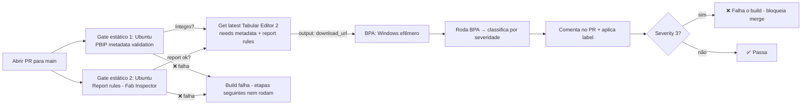

# CI/CD Power BI → Fabric — Documentação do Projeto

> Documento vivo. Serve como **memória do projeto**: como a esteira funciona, decisões tomadas,
> explicações técnicas e próximos passos. Atualize conforme o projeto evolui.

---

## 1. Objetivo

Demonstrar, na prática (demo/PoC, com autenticação e processos simplificados), uma **esteira de
CI/CD de Power BI até o Microsoft Fabric**, com **quality gates** em duas camadas:

- **GitHub** → validação automática do modelo semântico via **BPA (Best Practice Analyzer)** em cada Pull Request.
- **Fabric** (fase futura) → promoção entre ambientes (Dev → Prod) via **deployment pipelines** com regras de qualidade.

Projeto de referência que inspirou a implementação:
[vlpatkosdani/powerbi-cicd-with-githubactions-demos](https://github.com/vlpatkosdani/powerbi-cicd-with-githubactions-demos).

---

## 2. Estado atual (o que já está pronto)

**Fase 1 — Quality Gate no GitHub: ✅ concluída.**

- Repositório: `joaopedropeira/fabric-ci-cd`
- Projeto demo: `pbi-project/CustomerProfitabilitySample.pbip` (SemanticModel em TMDL + Report).
- Esteira implementada na branch `feature/ci-bpa-gate` (validada via PR).

Em cada **Pull Request para `main`**, a esteira:
1. Baixa o **Tabular Editor 2**.
2. Roda o **BPA** sobre o modelo semântico.
3. Classifica as violações por severidade.
4. **Comenta no PR** com o resultado + aplica label (`bpa-passed` / `bpa-warning` / `bpa-failed`).
5. **Falha o build** se houver violação **Severity 3 (Must Correct)** — bloqueando o merge.

> Observação: o modelo demo contém *auto-date tables* (`LocalDateTable_*`, `DateTableTemplate_*`),
> que a regra "Remove auto-date table" trata como Severity 3. Por isso o gate **reprova** de início —
> ótimo para demonstrar o bloqueio funcionando.

---

## 3. Como a esteira funciona (arquitetura)

Tudo é **pipeline-as-code**: o arquivo `.yml` versionado **é** a infraestrutura. Não há
provisionamento manual no portal — ao abrir o PR, o GitHub cria **runners efêmeros** sob demanda,
executa os passos e destrói as máquinas.



**Ordem de execução:**
1. **Em paralelo** (gates estáticos que rodam nos arquivos): `Validate_PBIP_Metadata` e `Report_Rules_PBI_Inspector`.
2. **Na sequência** (só se os dois gates acima passarem): `Get_Latest_TabularEditor2_Download_Link` → `BPA`.

Assim, os checks mais rápidos e baratos (sintaxe/integridade e relatório) rodam primeiro e **em paralelo**;
o BPA (mais pesado, baixa o TE2 e roda em Windows) só é acionado se a base estiver sã.

### Os jobs do workflow (`.github/workflows/bpa-quality-gate.yml`)

| Job | Runner | Ordem | O que faz |
|---|---|---|---|
| `Validate_PBIP_Metadata` | `ubuntu-latest` | 1 (paralelo) | Valida **integridade/sintaxe** dos arquivos PBIP (ver seção 4.1). |
| `Report_Rules_PBI_Inspector` | `ubuntu-latest` | 1 (paralelo) | Baixa a CLI do **Fab Inspector** (PBI Inspector V2) e valida boas práticas do **relatório** (ver seção 4.2). |
| `Get_Latest_TabularEditor2_Download_Link` | `ubuntu-latest` | 2 | `needs` os dois gates acima. Acha a última versão do Tabular Editor 2 e expõe a URL como *output*. |
| `BPA` | `windows-latest` | 2 | `needs` Get_Latest. Baixa o TE2, roda a macro do BPA sobre o **modelo**, comenta no PR e falha se Severity 3. |

### 3.1. Os dois gates estáticos paralelos — o que cada um valida

Ambos rodam **primeiro e em paralelo**, mas olham para **partes diferentes** do projeto e **não competem**:

| Aspecto | `Validate_PBIP_Metadata` | `Report_Rules_PBI_Inspector` |
|---|---|---|
| **Pergunta que responde** | "Os arquivos estão **íntegros e bem-formados**?" | "O **relatório** segue boas práticas visuais?" |
| **O que olha** | Estrutura de arquivos: `.pbip`, `.pbir`, `.pbism`, `.platform`, `report.json`, `version.json`, `pages.json`, TMDL | Conteúdo visual do **`.Report`**: visuais, páginas, cores, filtros, temas |
| **Camada** | "Arquivo" (sintaxe/estrutura) — **antes** de qualquer análise semântica | "Relatório" (VisOps) — qualidade de UX/design |
| **Ferramenta** | Script Python próprio (stdlib) | Fab Inspector CLI + `fabinspector-report-rules.json` |
| **Toca no modelo semântico?** | Não (só valida existência do `.SemanticModel`) | Não |
| **Toca no relatório?** | Só valida existência/JSON válido | **Sim** — é o foco dele |
| **Exemplos de falha** | JSON quebrado, `.pbir` apontando para pasta inexistente, TMDL vazio, cache local commitado | Cores fora do tema, páginas "Page 1", muitos visuais por página, página oculta indevida |

> Em uma frase: o **metadata** garante que o projeto **abre e é portável**; o **report rules**
> garante que o relatório está **bem construído visualmente**. O **BPA** (etapa 2) cuida do **modelo**.

---

## 4. Os arquivos da pasta `scripts/`

| Arquivo | Responsabilidade |
|---|---|
| `pbip_metadata_validation.py` | **Validação estática de metadados** (roda antes do BPA). Checa integridade dos arquivos PBIP — ver seção 4.1. Sem dependências (só stdlib). |
| `pbip_pr_comment.py` | Posta o resultado da validação de metadados como comentário no PR + label `metadata-*`. |
| `fabinspector-report-rules.json` | **Regras de relatório** (base rules oficiais do Fab Inspector / PBI Inspector V2). Customizável. |
| `fabinspector_pr_comment.py` | Posta o resultado das regras de relatório como comentário no PR + label `reportrules-*`. |
| `Custom_TA_Macro_for_BPA.csx` | **Macro C#** do Tabular Editor. Abre o modelo (`TMDL_PATH`), carrega as regras do `BPA_Rules.json`, roda o BPA e exporta `BPA_Results.csv` (separado por TAB). |
| `BPA_Rules.json` | **O "rulebook"** — as 75 regras, cada uma com `ID`, expressão de detecção e `CustomSeverity` (1/2/3). É o coração do gate. |
| `bpa_result_analysis.py` | **Classificador.** Cruza o CSV com o JSON pelo `RuleID`, separa em `must_correct/correct_asap/nice_to_have.csv` e seta a variável `SEVERITY_3_FOUND` (que faz o gate reprovar). |
| `pr_comment.py` | **Comunicador.** Monta o comentário em markdown, posta no PR via API do GitHub e aplica a label `bpa-*`. |
| `bpa_rules.md` | **Documentação das regras** (descrições + âncoras). O `pr_comment.py` gera links apontando para este arquivo. |

**Fluxo em uma frase:** a macro `.csx` usa o `BPA_Rules.json` para gerar o `BPA_Results.csv` →
`bpa_result_analysis.py` classifica por severidade → `pr_comment.py` publica no PR (com links para o
`bpa_rules.md`), enquanto `SEVERITY_3_FOUND` decide se o gate passa ou falha.

### 4.1. PBIP metadata validation (`pbip_metadata_validation.py`)

Gate **estático** que roda **antes do BPA** — valida sintaxe e integridade dos arquivos do projeto
(não olha boas práticas do modelo, isso é papel do BPA). Checagens atuais:

1. **JSON bem-formado** — todo `*.json` do projeto faz parse sem erro.
2. **Referências do `.pbip`** — os `artifacts` apontam para pastas `.Report`/`.SemanticModel` existentes.
3. **Referência do `.pbir`** — `datasetReference.byPath` aponta para um SemanticModel existente.
4. **Sem caminhos absolutos** — nenhum `C:\`, `\\UNC` ou `file://` (quebraria a portabilidade).
5. **Arquivos obrigatórios** — cada Report tem `definition.pbir`, `report.json`, `version.json`,
   `pages.json`, `.platform`; cada SemanticModel tem `definition.pbism`, `model.tmdl`, `database.tmdl`, `.platform`.
6. **Versão/formato** — metadados de versão presentes; TMDL core não vazio.
7. **Recursos referenciados existem** — imagens/temas em `resourcePackages` apontam para arquivos reais
   (sem referência quebrada).
8. **Higiene do `.gitignore`** — `localSettings.json`/`cache.abf` ignorados e **não commitados**
   (checa via `git ls-files`, não a presença em disco).

Falha (exit 1) em qualquer **erro**; *warnings* não reprovam. Rode local com
`python scripts/pbip_metadata_validation.py`.

### 4.2. Report rules — Fab Inspector / PBI Inspector V2 (`fabinspector-report-rules.json`)

Gate **estático** que valida a **camada visual do relatório** (VisOps), rodando **em paralelo** com o
metadata. Usa o **Fab Inspector** (evolução do PBI Inspector V2) em **modo local** — lê os arquivos do
`.Report` direto do checkout, **sem Fabric e sem autenticação**.

- **Como roda:** o job baixa a CLI Linux do Fab Inspector e executa
  `fab-inspector -fabricitem <.Report> -rules scripts/fabinspector-report-rules.json -formats "Console,GitHub"`.
- **`-formats GitHub`** gera anotações inline no PR; o `-formats Console` é capturado para o comentário.
- **Falha** o job quando há violação (exit code != 0), bloqueando as etapas seguintes.
- **Regras** (`fabinspector-report-rules.json`): base rules oficiais, focadas em qualidade visual. Exemplos:
  reduzir nº de visuais/página, evitar cores fora do tema, ocultar páginas de tooltip/drillthrough,
  evitar páginas com nome padrão "Page 1", páginas que rolam verticalmente, alt-text (acessibilidade).
- **Customização:** editar parâmetros (ex.: `paramMaxVisualsPerPage`) ou marcar `"disabled": true` numa regra.

> Nota: apesar do nome "Fab", aqui ele é usado **puramente como testador de relatório PBI local** — o
> V1 (nome antigo) não suporta o formato **PBIR**, por isso usamos o V2 (Fab Inspector).

---

## 5. As regras do BPA

O `BPA_Rules.json` é **totalmente customizável**. As 75 regras atuais são o **conjunto oficial da
Microsoft** (mantido por Michael Kovalsky), com 2 campos extras adicionados pela demo (`CustomSeverity` e `Anchor`).

### Onde encontrar mais regras
- **Fonte oficial:** [microsoft/Analysis-Services → BestPracticeRules](https://github.com/microsoft/Analysis-Services/tree/master/BestPracticeRules)
- **JSON bruto:** `https://raw.githubusercontent.com/microsoft/Analysis-Services/master/BestPracticeRules/BPARules.json`
- **Docs do Tabular Editor:** [Built-in BPA Rules](https://docs.tabulareditor.com/en/features/built-in-bpa-rules.html) · [Sample Rules Expressions](https://docs.tabulareditor.com/en/features/using-bpa-sample-rules-expressions.html)

### Anatomia de uma regra (como criar novas)

Exemplo real do nosso arquivo (a regra do `DIVIDE`):

```json
{
  "Name": "Avoid division (use DIVIDE function instead)",
  "Category": "DAX Expressions",
  "Description": "... use DIVIDE(<numerator>,<denominator>) ...",
  "Severity": 3,
  "Scope": "Measure, CalculatedColumn, CalculatedTable",
  "Expression": "Tokenize().Any( Type = DIV and Next.Type <> INTEGER_LITERAL and Next.Type <> REAL_LITERAL )",
  "CompatibilityLevel": 1200,
  "ID": 52,
  "CustomSeverity": 3,
  "Anchor": "avoid-division-use-divide-function-instead"
}
```

| Campo | O que é |
|---|---|
| `Name` / `Category` / `Description` | Identificação e documentação da regra. |
| `Scope` | **Em quais tipos de objeto** a regra roda (Measure, DataColumn, Table, Relationship...). |
| `Expression` | **O coração da regra**: expressão em **Dynamic LINQ** sobre o Tabular Object Model. Retorna `true` quando o objeto **viola** a regra. |
| `Severity` | Severidade "oficial" (padrão do Tabular Editor). |
| `CustomSeverity` | **Campo adicionado pela demo** — é o que o nosso gate usa (`3` = reprova o build). |
| `ID` / `Anchor` | Usados pelos scripts para cruzar CSV ↔ regra e montar os links do PR. |

### Fluxo recomendado para criar uma regra nova (sem escrever JSON na mão)

1. Abra o **Tabular Editor 2** (mesmo o gratuito) e conecte no seu `.pbip`.
2. `Tools → Manage BPA Rules...` → selecione uma coleção com permissão de escrita.
3. Clique **Add**, defina `Name`, `Category`, `Scope` e a **`Expression`** (o editor tem IntelliSense e botão de testar contra o modelo).
4. Teste na aba do BPA (**F10**) para ver os objetos violando.
5. **Exporte a coleção para JSON** e traga o conteúdo para o `scripts/BPA_Rules.json` — depois adicione os campos `CustomSeverity`, `ID` e `Anchor` (específicos da nossa esteira) e a descrição no `scripts/bpa_rules.md`.

> Dica: para "puxar" o ruleset oficial completo e atualizado para dentro do TE, rode na janela de
> **Advanced Scripting** o script de download que o próprio repositório oficial fornece (baixa o
> `BPARules.json` para `%localappdata%\TabularEditor\`).

---

## 6. Severidades (como o gate decide)

| CustomSeverity | Rótulo | Efeito no gate | Label no PR |
|:--:|---|---|---|
| 3 | 🚨 Must Correct | **Reprova** o build (bloqueia merge) | `bpa-failed` |
| 2 | ⚡ Correct ASAP | Passa, mas alerta | `bpa-warning` |
| 1 | 💡 Nice to Have | Passa | `bpa-passed` |

Para ajustar o rigor da demo, basta mudar o `CustomSeverity` de uma regra no `BPA_Rules.json`.

---

## 7. Decisões de design

- **Single-repo** (não o padrão de repositório central da referência): 1 workflow, sem PAT, usando o
  `GITHUB_TOKEN` nativo. Menos peças para a demo.
- **IaC simples**: apenas workflow + scripts versionados. Sem Terraform e sem branch protection nesta fase.
- **Fidelidade**: os scripts foram baixados dos originais da referência e apenas adaptados nos caminhos
  (modelo, regras, repo).

---

## 8. Roadmap

### Fase 1 — GitHub (em evolução)
- [x] Workflow de PR com BPA
- [x] Comentário automático + labels no PR
- [x] Falha por Severity 3
- [x] **PBIP metadata validation** (gate estático antes do BPA) — ver seção 4.1
- [x] **Report rules** com **PBI Inspector V2 / Fab Inspector** (boas práticas do relatório — estático)
- [ ] (opcional) **Branch protection** exigindo o check verde antes do merge — ver seção 8.1
- [ ] (opcional) Sincronizar `BPA_Rules.json` com a versão oficial mais recente

### 8.1. Branch protection — gate que "avisa" vs. gate que "obriga"

**Ponto importante:** por padrão, um check que falha no GitHub **apenas sinaliza** (o ❌ vermelho),
mas **não impede o merge**. Hoje o nosso gate está no modo "recomendação": mostra o problema, mas o
PR ainda pode ser aprovado e mergeado normalmente.

| Situação | Merge permitido mesmo com Severity 3? |
|---|---|
| Hoje (sem branch protection) | ✅ Sim — o ❌ é só informativo |
| Com branch protection exigindo o check "BPA" | ❌ Não — merge bloqueado até ficar verde |

Para tornar o gate **realmente bloqueante**, é preciso ativar a *branch protection* na `main`:

- **Via UI:** `Settings → Branches → Add branch ruleset` (ou *Add rule*) →
  **Require status checks to pass before merging** → selecionar o check **"BPA"**.
- **Via IaC (opcional):** Terraform com o provider `integrations/github` declarando a regra de proteção.

Decisão atual: **não ativado** nesta fase (optamos pelo IaC mais simples). Fica registrado para ativar
quando quisermos que o gate obrigue de fato — possivelmente junto com a Fase 2.

### 8.2. Outras travas de qualidade (mapa completo)

Além do BPA, existem outras travas que **se complementam** (não competem). A chave é separar por
**natureza**: *estáticas* rodam nos arquivos no PR (baratas, sem capacity); *dinâmicas* precisam de um
modelo publicado e atualizado (workspace + capacity) → pertencem à Fase 2 (Fabric).

| # | Trava | Natureza | O que valida | Ferramenta | Compete com BPA? |
|---|---|---|---|---|---|
| 1 | **PBIP metadata validation** | Estática | Integridade dos arquivos `.pbip`/TMDL/JSON | Script Python (stdlib) | ❌ camada "arquivo", antes do BPA |
| 2 | **BPA** | Estática | Boas práticas do **modelo** semântico | Tabular Editor 2 | — (é o BPA) |
| 3 | **Report rules (VisOps)** | Estática | Boas práticas do **relatório** (visuais, cores, páginas, acessibilidade) | **PBI Inspector V2** | ❌ BPA não olha o relatório |
| 4 | **DAX correctness tests** | Dinâmica | Medidas retornam o **valor esperado** (regras de negócio, regressão) | DAX Query View Testing Pattern / semantic-link-labs | ❌ BPA vê forma, isto vê resultado |
| 5 | **Refresh test** | Dinâmica | O modelo **atualiza sem erro** | Fabric REST API / XMLA / semantic-link | ❌ |
| 6 | **Performance smoke tests** | Dinâmica | Tempo de resposta de medidas-chave dentro do limite | DAX Studio CLI / semantic-link-labs | ❌ |

**Por que não conflitam:** cada trava responde uma pergunta diferente e (no caso de BPA vs. Report
rules) nem tocam nos mesmos arquivos — o BPA só enxerga o `SemanticModel`, o PBI Inspector só o `Report`.

**Nota sobre o PBI Inspector:** o nosso report usa o **formato PBIR novo** (pasta `definition/pages/...`).
O PBI Inspector **V1 não suporta PBIR** — é preciso o **V2** (repositório separado).

**Sequência recomendada:**
- Fase 1 (estático, no PR): [1] metadata ✅ → [3] PBI Inspector V2 (próximo) → BPA já existe.
- Fase 2 (dinâmico, exige Fabric Dev): [5] refresh → [4] DAX tests → [6] performance.

---

### Fase 2 — Fabric (planejada)
- [ ] Deploy pós-gate para o workspace **Dev** do Fabric (via `fabric-cicd`, Git integration ou REST API)
- [ ] **Deployment pipeline** Fabric **Dev → Prod** com regras de qualidade
- [ ] Criação do workspace **Prod**
- [ ] Autenticação (SPN / trial) simplificada para a demo

---

## 9. Como testar a esteira

1. Crie uma branch a partir de `main` e faça uma alteração no modelo (`pbi-project/...`).
2. Abra um **Pull Request para `main`**.
3. Acompanhe em **Actions** → job "Power BI BPA Quality Gate".
4. Veja o **comentário do BPA** e a **label** no PR; os CSVs ficam nos *artifacts* da run.
5. Se houver Severity 3, o gate **reprova** — corrija e faça novo push para ficar verde.

---

## 9.1. Conceitos importantes (dos artigos de referência)

Resumo objetivo dos pontos que explicam **por que** a esteira foi desenhada assim (baseado na série
"Building your Power BI CI/CD pipeline" do blog Fabricated Insights).

### a) Os 3 níveis de severidade

O BPA classifica cada problema em 3 níveis. É o conceito central do gate:

| Nível | Nome oficial | Significado | Exemplo |
|:--:|---|---|---|
| 1 | ℹ️ Information | Sugestão / boa prática | Papéis de RLS sem membros |
| 2 | ⚠️ Warning | Importante, mas depende do contexto | Duas medidas com a mesma definição DAX |
| 3 | 🛑 Error | Deve ser corrigido antes de publicar | Colunas numéricas com summarization padrão |

> Quanto maior o nível, maior o impacto no modelo. **Só o Severity 3 reprova o build.**

### b) A diferença crítica: BPA na UI vs. na CLI (o "pulo do gato")

Este é o ponto **mais importante** para entender a esteira:

- **Na UI do Tabular Editor** (rodando manual no seu PC): você vê **todos** os problemas numa lista e
  decide o que ignorar. É flexível e informativo.
- **Na CLI** (que o GitHub Actions usa): a execução é **rígida**. Ao encontrar um **Severity 3**, ela
  **para imediatamente** e marca o workflow como falho (`exit code 1`) — sem mostrar o resto dos problemas.

**Consequência:** o erro `exit code 1` sozinho não diz *onde* nem *por quê* falhou, e se houver vários
Severity 3 você teria que corrigir um, rodar de novo, corrigir outro... Foi exatamente esse problema que
os scripts Python (análise + comentário no PR) vieram resolver: rodar tudo, classificar e mostrar o
panorama completo de uma vez.

### c) Por que customizar as regras e a severidade (`CustomSeverity`)

Nem todo projeto precisa do mesmo rigor. Por isso a demo adicionou o campo **`CustomSeverity`**, que
permite:

- **Sobrescrever** a severidade oficial de uma regra (subir ou descer).
- **Alinhar** a importância das regras aos padrões do seu time.
- **Controlar** o que **bloqueia deploy** (3) vs. o que é só **aviso** (2) ou **sugestão** (1).

Exemplos práticos do autor:
- **Subiu** "integridade referencial" de 2 → 3 (gera valores `(Blank)` e erode a confiança no relatório).
- **Desceu** "Provide format string for measures" de 3 → 2 (relevante, mas não deve bloquear deploy).
- **Removeu** regras de convenção de nomes (o time não adota convenção estrita — só geraria ruído).

> Lição: comece pelo ruleset oficial, **teste no Tabular Editor**, e vá ajustando severidades/removendo
> regras conforme a realidade do time. A configuração do BPA deve **evoluir** com o time.

### d) Por que comentar no PR (e não só falhar o build)

Deixar só o `exit code 1` obriga o dev a: ir na aba Actions → achar a run → baixar artifact `.zip` →
extrair → abrir CSV... (~12 passos) e ainda **entender** o que significa. O comentário automático no PR
reduz isso para ~5 passos e traz 5 benefícios:

1. **Feedback onde o dev já está** (no PR) — sem trocar de contexto.
2. **Status claro de deploy** — começa com um ✅/❌ direto ("pode ou não publicar").
3. **Valor educativo** — cada violação tem link para a descrição da regra (o `bpa_rules.md`): o dev
   aprende *por que* aquilo importa, não só corrige para passar.
4. **Menos suporte** — responde sozinho "por que falhou?", "o que corrigir?", "quais objetos?".
5. **Histórico** — o thread do PR vira um registro do que existia e do que foi corrigido.

Detalhes de implementação do comentário: Severity 3 vem **expandido** por padrão (visível na hora),
Severity 2 e 1 vêm **recolhidos**; e há um *fallback* para o limite de 65.000 caracteres do GitHub
(recolhe as severidades menores, mantendo sempre o Severity 3 visível).

### e) Automação vs. supervisão humana

O autor recomenda **não** automatizar 100% (aprovar/rejeitar tudo sozinho). O ideal: automatizar o
repetitivo e óbvio (BPA), mas **deixar espaço para aprovação manual** em decisões nuançadas
(performance, modelagem complexa). Confiar no time importa.

### f) A série completa (contexto de onde a solução veio)

| Parte | Tema | O que trouxe para a nossa esteira |
|---|---|---|
| Part 1 (conceito) | Por que usar BPA | Justificativa do gate de qualidade |
| Part 2 (conceito) | Severidades + UI vs CLI + custom rules | Base do `BPA_Rules.json` e do `CustomSeverity` |
| Part 1 (prático) | Workflow rodando BPA no PR | Base do `bpa-quality-gate.yml` |
| Part 2 (prático) | Macro C# consolidando em CSV | Base do `Custom_TA_Macro_for_BPA.csx` |
| Part 3 (prático) | Análise + comentário no PR | Base do `bpa_result_analysis.py` e `pr_comment.py` |
| Part 4 (prático) | Repositório central / templates | **Não adotado** (optamos por single-repo) |

---

## 9.4. Dados no Fabric — por que o report fica vazio (e como resolver)

**Sintoma:** ao integrar o PBIP com o Fabric (Git integration), o semantic model chega **só com a
estrutura** (metadados); o report renderiza **sem dados**.

**Causa raiz — dois fatos:**
1. **O formato PBIP não guarda os dados**, apenas a definição (TMDL). O snapshot de dados fica no cache
   local (`.pbi/cache.abf`, que está no `.gitignore`). Por isso o Fabric só recebe a estrutura e
   precisaria fazer **refresh** para popular os dados.
2. **As fontes de dados deste sample são inacessíveis.** O "Customer Profitability Sample" (Obvience/
   Microsoft) é distribuído como `.pbix` com dados já importados; as queries M apontam para infra
   **local/privada do autor** que ninguém alcança. Então o refresh no Fabric **falha** → sem dados.

### Inventário das fontes por tabela

| Tabela | Fonte no M | Reachable? |
|---|---|---|
| BU, Date, Executive, Fact, Industry, State | `Sql.Database(".", "IP", ...)` (SQL Server local do autor) | ❌ |
| Customer | `Excel.Workbook(File.Contents("C:\Users\mad\Dropbox\...\dimCustomer.xlsx"))` | ❌ |
| **Product, Scenario** | `Table.FromRows(Json.Document(Binary.Decompress(...)))` — **dados embutidos no próprio M** | ✅ |

> Ou seja, **7 tabelas** precisam ser repontadas; **Product e Scenario já são self-contained** (o
> próprio Power BI embute dimensões pequenas inline — é justamente o padrão que recomendamos abaixo).

### Mapa de relacionamentos (para manter os dados consistentes ao repontar)

```
Fact[BU Key]        → BU[BU Key]            BU[Executive_id]  → Executive[ID]
Fact[YearPeriod]    → Date[YearPeriod]      Customer[Industry ID] → Industry[ID]
Fact[Scenario Key]  → Scenario[Scenario Key]  Customer[State]   → State[StateCode]
Fact[Product Key]   → Product[Product Key]
Fact[Customer Key]  → Customer[Customer]
```

⚠️ Atenção a tipos: `Fact[Product Key]` é **text**, mas `Product[Product Key]` é **int64** — ao repontar,
alinhe os tipos/valores das chaves, senão os relacionamentos resolvem em `(Blank)`.

### Como resolver (opções)

- **Opção A — Dados mock self-contained (recomendada p/ demo):** reescrever a partição das 7 tabelas para
  `Table.FromRows`/`#table` com dados inline (mesmo padrão que Product/Scenario já usam). Vantagem:
  refresh funciona **em qualquer lugar** (Fabric incluso), sem dependência externa. Requer gerar dados
  pequenos batendo com colunas/tipos e **chaves consistentes** com o mapa acima.
- **Opção B — Fabric Lakehouse/OneLake:** subir os dados (CSV/Parquet) num Lakehouse do workspace dev e
  repontar o M para ler de lá. Mais "Fabric-native", porém com passos manuais no portal.
- **Opção C — Manter sem dados:** o CI/CD (BPA, metadata, report rules) **não precisa de dados** — valida
  a *definição*. Aceitável se o foco for só a esteira.

### Decisão registrada

O modelo **não foi alterado automaticamente** de propósito: é uma mudança **all-or-nothing** em 7 tabelas
interdependentes, com risco de "refresh OK porém tudo `(Blank)`", e **não é verificável sem abrir o
Power BI / rodar um refresh real** no Fabric. Para não arriscar o artefato que a esteira de CI/CD usa,
a correção fica documentada aqui, pronta para aplicar com validação (idealmente a Opção A ou B).

---

## 10. Referências

- Repositório de referência: https://github.com/vlpatkosdani/powerbi-cicd-with-githubactions-demos
- Regras oficiais (BPA): https://github.com/microsoft/Analysis-Services/tree/master/BestPracticeRules
- Best Practice Analyzer (docs): https://docs.tabulareditor.com/en/features/Best-Practice-Analyzer.html
- Tabular Editor: https://tabulareditor.com/

**Série de artigos (Fabricated Insights — Daniel Patkos):**
- Conceito Part 2 — Severidades, UI vs CLI, custom rules: https://fabricatedinsights.substack.com/p/building-your-power-bi-cicd-pipeline-660
- Prático Part 1 — Workflow do BPA no PR: https://fabricatedinsights.substack.com/p/building-your-power-bi-cicd-pipeline-7f9
- Prático Part 3 — Comentário automático no PR: https://fabricatedinsights.substack.com/p/making-bpa-results-actionable-with

**Outras travas de qualidade:**
- PBI Inspector V2 (report rules / VisOps, suporta PBIR): https://github.com/NatVanG/PBI-InspectorV2
- Build pipelines PBIP (Microsoft Learn — BPA + PBI Inspector): https://learn.microsoft.com/power-bi/developer/projects/projects-build-pipelines
- DAX Query View Testing Pattern (M. Kovalsky): https://www.elegantbi.com/post/dax-query-view-testing-pattern
- semantic-link-labs (testes/refresh/performance via Python): https://github.com/microsoft/semantic-link-labs
